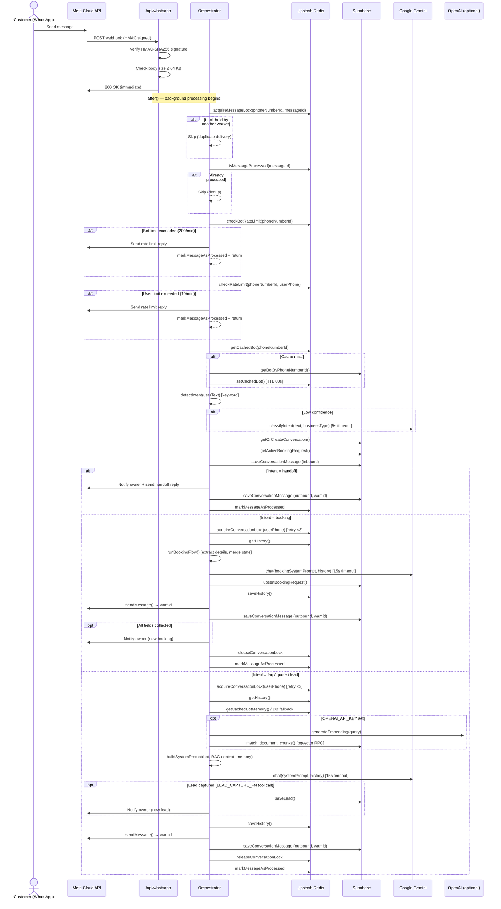
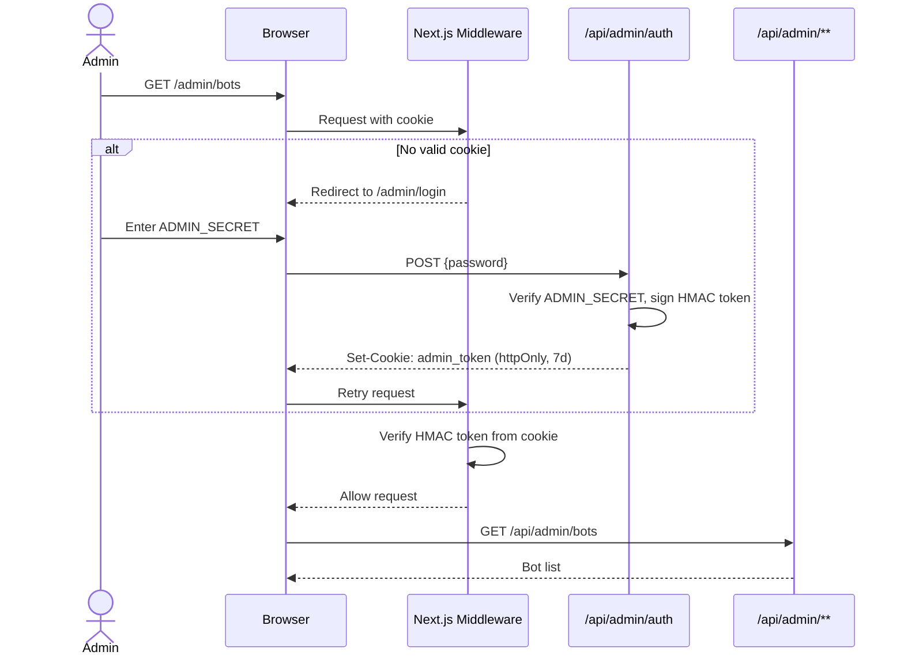
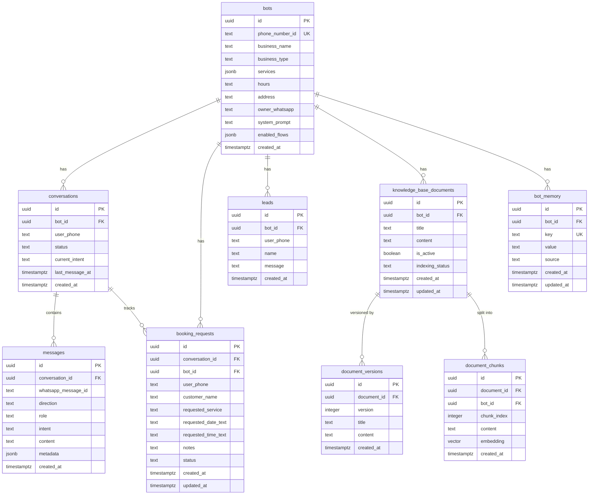
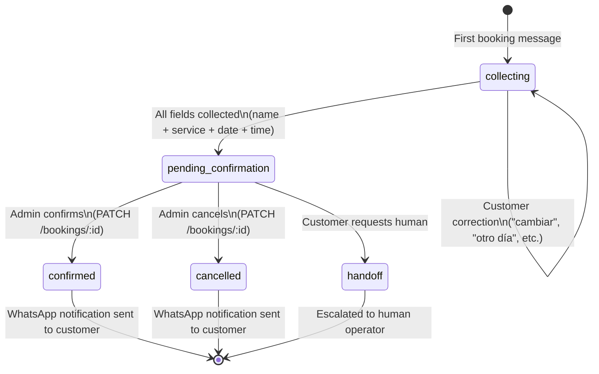
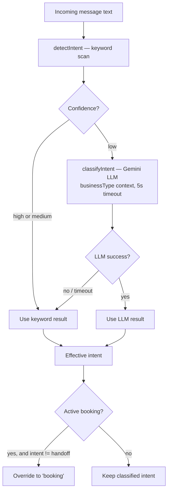
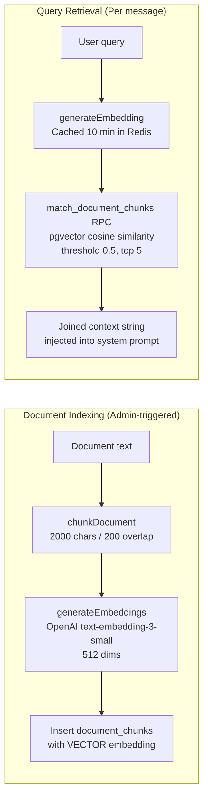

# Nexo Bot — Technical Documentation

> Production-level technical reference for the Nexo Bot WhatsApp chatbot platform.

---

## Table of Contents

1. [Project Overview](#1-project-overview)
2. [Tech Stack](#2-tech-stack)
3. [System Architecture](#3-system-architecture)
4. [Component Reference](#4-component-reference)
5. [Message Processing Pipeline](#5-message-processing-pipeline)
6. [Admin Panel](#6-admin-panel)
7. [Database Schema](#7-database-schema)
8. [Redis Key Reference](#8-redis-key-reference)
9. [API Reference](#9-api-reference)
10. [Booking State Machine](#10-booking-state-machine)
11. [Intent Classification](#11-intent-classification)
12. [RAG Pipeline](#12-rag-pipeline)
13. [Security Architecture](#13-security-architecture)
14. [Environment Variables](#14-environment-variables)
15. [Deployment Guide](#15-deployment-guide)
16. [Operational Runbook](#16-operational-runbook)

---

## 1. Project Overview

Nexo Bot is a **multi-tenant WhatsApp chatbot platform** for Chilean small and medium businesses (SMBs). Each business (tenant) gets its own chatbot tied to a dedicated WhatsApp Business phone number. The bot handles inbound customer messages, classifies intent, answers FAQs from a custom knowledge base, collects booking requests, captures leads, and escalates to a human when needed.

### Key capabilities

| Capability | Description |
|---|---|
| Multi-tenant | Each bot has its own phone number, knowledge base, memory, and configuration |
| AI-powered | Google Gemini 2.5 Flash for conversation; OpenAI text-embedding-3-small for semantic search |
| Booking flow | Incremental field collection with state machine (name → service → date → time) |
| RAG | Documents chunked, embedded, and retrieved via pgvector cosine similarity |
| Admin panel | Full web UI for bot config, conversation inbox, bookings, knowledge base, memory |
| Graceful degradation | Circuit breaker + fallback replies when AI providers are down |

---

## 2. Tech Stack

| Layer | Technology | Version | Purpose |
|---|---|---|---|
| Framework | Next.js (App Router) | 15.1.6 | Full-stack React framework, API routes, SSR |
| Language | TypeScript | 5.x | Type safety across the entire codebase |
| AI — Chat | Google Gemini 2.5 Flash | via `@google/generative-ai` | Conversation, intent classification, lead capture |
| AI — Embeddings | OpenAI text-embedding-3-small | via `openai` SDK | 512-dim vectors for semantic search (optional) |
| Database | Supabase (PostgreSQL + pgvector) | `@supabase/supabase-js` v2 | Persistent storage, vector similarity search |
| Cache / State | Upstash Redis | `@upstash/redis` v1 | Session history, rate limiting, locks, config cache |
| Messaging | Meta WhatsApp Business API | Graph API v21.0 | Inbound webhooks, outbound message delivery |
| Styling | Tailwind CSS | 4.2 | Admin UI styling |
| Hosting | Vercel | — | Serverless deployment, `after()` for background processing |

---

## 3. System Architecture

### High-level overview

```mermaid
graph TB
    subgraph Customer["Customer (WhatsApp)"]
        WA[WhatsApp App]
    end

    subgraph Meta["Meta Platform"]
        WABA[WhatsApp Business API\nGraph API v21.0]
    end

    subgraph Vercel["Vercel — Nexo Bot"]
        MW[Next.js Middleware\nAdmin Auth]
        WH[/api/whatsapp\nWebhook Handler]
        ADMIN[/api/admin/**\nAdmin REST API]
        ORCH[Orchestrator\nMessage Pipeline]
        UI[Admin Panel\nNext.js SSR Pages]
    end

    subgraph External["External Services"]
        GEMINI[Google Gemini\n2.5 Flash]
        OPENAI[OpenAI\ntext-embedding-3-small]
    end

    subgraph Data["Data Layer"]
        SUPA[Supabase\nPostgreSQL + pgvector]
        REDIS[Upstash Redis\nCache + Locks + State]
    end

    WA -- "Send message" --> WABA
    WABA -- "POST webhook" --> WH
    WH -- "after()" --> ORCH
    ORCH -- "Chat / Classify" --> GEMINI
    ORCH -- "Embed query" --> OPENAI
    ORCH -- "Read/write" --> SUPA
    ORCH -- "Cache / Lock / Rate" --> REDIS
    ORCH -- "Send reply" --> WABA
    WABA -- "Deliver reply" --> WA

    UI --> ADMIN
    MW -- "Guard /admin/*" --> ADMIN
    ADMIN --> SUPA
    ADMIN -- "Invalidate cache" --> REDIS
```

### Data flow summary

1. Customer sends a WhatsApp message → Meta delivers a signed webhook `POST` to `/api/whatsapp`.
2. The handler verifies the HMAC-SHA256 signature and calls `after(processIncomingMessage(...))` — returning `200 OK` to Meta immediately.
3. The orchestrator runs asynchronously: acquires locks, checks deduplication, applies rate limits, fetches bot config, classifies intent, builds context, calls Gemini, and sends the reply back through the Meta API.
4. All conversation state is persisted to Supabase; session history, caches, and locks live in Redis.

---

## 4. Component Reference

### Source tree

```
src/
├── app/
│   ├── api/
│   │   ├── whatsapp/route.ts          # Public webhook (GET verification + POST inbound)
│   │   └── admin/
│   │       ├── auth/route.ts          # Login — issue session cookie
│   │       ├── logout/route.ts        # Logout — clear cookie
│   │       └── bots/
│   │           ├── route.ts           # List / Create bots
│   │           └── [botId]/
│   │               ├── route.ts       # Get / Update bot
│   │               ├── flows/route.ts # Get / Update enabled flows
│   │               ├── bookings/
│   │               │   ├── route.ts   # List bookings
│   │               │   └── [bookingId]/route.ts  # Confirm / Cancel booking
│   │               ├── conversations/
│   │               │   ├── route.ts   # List conversations (paginated)
│   │               │   └── [conversationId]/
│   │               │       ├── route.ts           # Update status
│   │               │       ├── messages/route.ts  # List messages
│   │               │       └── label/route.ts     # Apply intent label
│   │               ├── knowledge-base/
│   │               │   ├── route.ts               # List / Create documents
│   │               │   └── [documentId]/
│   │               │       ├── route.ts            # Get / Update / Delete
│   │               │       ├── index/route.ts      # Trigger embedding indexing
│   │               │       ├── versions/route.ts   # List versions
│   │               │       └── rollback/route.ts   # Rollback to version
│   │               └── memory/
│   │                   ├── route.ts               # List / Create memory entries
│   │                   └── [memoryId]/route.ts    # Delete memory entry
│   └── admin/                         # Admin Next.js pages (SSR)
├── lib/
│   ├── env.ts           # Env var validation + typed proxy
│   ├── logger.ts        # Structured JSON logging
│   ├── types.ts         # All shared TypeScript interfaces
│   ├── orchestrator.ts  # Message processing pipeline (entry point)
│   ├── whatsapp.ts      # Meta API client + webhook parser
│   ├── gemini.ts        # Gemini AI chat + intent classification
│   ├── embeddings.ts    # OpenAI embedding generation
│   ├── rag.ts           # Document chunking, indexing, retrieval
│   ├── intents.ts       # Keyword-based intent detection
│   ├── booking.ts       # Booking extraction + state machine
│   ├── prompts.ts       # System prompt builder
│   ├── redis.ts         # All Redis operations (cache, locks, rate limits)
│   ├── supabase.ts      # Barrel re-export of db/* modules
│   └── db/
│       ├── client.ts        # Supabase singleton
│       ├── bots.ts          # Bot CRUD
│       ├── conversations.ts # Conversation lifecycle
│       ├── messages.ts      # Message persistence
│       ├── booking.ts       # Booking request CRUD
│       ├── knowledge-base.ts # Document + version + chunk CRUD
│       └── memory.ts        # Bot memory CRUD
├── middleware.ts          # Admin route protection (HMAC cookie check)
└── supabase/
    ├── schema.sql         # Phase 1 — core tables
    ├── phase2.sql         # Phase 2 — knowledge base + vectors + memory
    └── phase3.sql         # Phase 3 — performance indexes
```

### Library module responsibilities

| Module | Responsibility |
|---|---|
| `env.ts` | Type-safe, eager-validated access to environment variables |
| `logger.ts` | Structured JSON logs with timestamp, level, and correlation ID |
| `orchestrator.ts` | Central pipeline: locks → dedup → rate limit → intent → dispatch |
| `whatsapp.ts` | HMAC verification, webhook parsing, outbound message send (returns `wamid`) |
| `gemini.ts` | Chat completions with timeout + retry; intent classification; lead capture tool call |
| `embeddings.ts` | OpenAI batch embedding generation (512-dim) |
| `rag.ts` | Document chunking (2000 chars / 200 overlap), embedding indexing, semantic retrieval |
| `intents.ts` | Fast keyword-based intent detection (runs before LLM classification) |
| `booking.ts` | Booking detail extraction from natural language + flow state machine |
| `prompts.ts` | Business-aware system prompt builder (hours, services, address, custom instructions) |
| `redis.ts` | Conversation history, message locks, conversation locks, rate limiters, circuit breaker, caches |
| `db/bots.ts` | Bot configuration CRUD |
| `db/conversations.ts` | Conversation lifecycle management |
| `db/messages.ts` | Message persistence with `whatsapp_message_id` tracking |
| `db/booking.ts` | Booking request state + lead persistence |
| `db/knowledge-base.ts` | Document, version, and chunk management |
| `db/memory.ts` | Bot memory key-value store |

---

## 5. Message Processing Pipeline

### Sequence diagram



### Pipeline steps in order

| Step | Component | Behavior on failure |
|---|---|---|
| 1. HMAC signature verification | `whatsapp.verifySignature` | Return 401 to Meta |
| 2. Body size guard | `route.ts` | Return 413 to Meta |
| 3. Payload parse | `whatsapp.parseWebhookPayload` | Return 200 (ignore non-text events) |
| 4. Env validation (cold-start) | `env.validateEnv` | Throw at startup, not mid-request |
| 5. Message lock (30s NX) | `redis.acquireMessageLock` | Fail-open on Redis error (log + proceed) |
| 6. Dedup check (48h window) | `redis.isMessageProcessed` | Fail-open on Redis error (log + proceed) |
| 7. Per-bot rate limit (200/min) | `redis.checkBotRateLimit` | Send rate limit reply |
| 8. Per-user rate limit (10/min) | `redis.checkRateLimit` | Send rate limit reply |
| 9. Bot config fetch | `db.getBotByPhoneNumberId` + Redis cache | Return early (no bot configured) |
| 10. Intent classification | `intents.detectIntent` → `gemini.classifyIntent` | Use keyword result as fallback |
| 11. Conversation lifecycle | `db.getOrCreateConversation` | Throw (unrecoverable) |
| 12. Conversation lock (25s NX) | `redis.acquireConversationLock` | Retry ×3, then fail-soft (proceed without lock) |
| 13. LLM / booking flow | Gemini + booking state machine | Circuit breaker → fallback reply |
| 14. Reply delivery | `whatsapp.sendMessage` | Throw → fallback reply path |
| 15. Dedup stamp | `redis.markMessageAsProcessed` | Redis error silently lost (rare double-process on retry) |

---

## 6. Admin Panel

### Authentication flow



### Admin panel pages

| Route | Purpose |
|---|---|
| `/admin/login` | Password login form |
| `/admin/bots` | List all bots with quick links |
| `/admin/bots/new` | Create a new bot |
| `/admin/bots/[botId]` | Bot dashboard |
| `/admin/bots/[botId]/edit` | Edit bot config (name, type, hours, address, services, system prompt) |
| `/admin/bots/[botId]/flows` | Toggle enabled/disabled intents per bot |
| `/admin/bots/[botId]/conversations` | Paginated conversation inbox |
| `/admin/bots/[botId]/conversations/[id]` | Full conversation thread with messages |
| `/admin/bots/[botId]/bookings` | Booking requests with status filter |
| `/admin/bots/[botId]/knowledge-base` | Document list with indexing status |
| `/admin/bots/[botId]/knowledge-base/new` | Create document |
| `/admin/bots/[botId]/knowledge-base/[docId]` | View/edit document, version history, rollback |
| `/admin/bots/[botId]/memory` | View and manage bot memory entries |

---

## 7. Database Schema

### Entity-relationship diagram



### Table notes

**`bots.enabled_flows`** — JSONB map controlling which intents are active per bot:
```json
{ "faq": true, "lead": true, "booking": true, "quote": false, "handoff": true }
```

**`bots.services`** — JSONB array of service objects:
```json
[{ "nombre": "Corte de cabello", "precio": "8000" }]
```

**`messages.direction`** — `'inbound'` (customer → bot) or `'outbound'` (bot → customer)

**`messages.whatsapp_message_id`** — Meta's `wamid` for outbound messages; enables delivery tracking.

**`booking_requests.status`** state machine:
`'collecting'` → `'pending_confirmation'` → `'confirmed'` | `'cancelled'` | `'handoff'`

**`knowledge_base_documents.indexing_status`**: `'pending'` | `'indexed'` | `'failed'`

**`document_chunks.embedding`** — `VECTOR(512)`, indexed with HNSW for fast cosine similarity search.

**`bot_memory.source`** — `'manual'` (admin-entered) | `'conversation'` (reserved for future AI-learned memories)

### Supabase RPC

```sql
-- Semantic similarity search with threshold
match_document_chunks(
  p_bot_id   UUID,
  p_embedding VECTOR(512),
  p_match_count INT DEFAULT 5,
  p_threshold FLOAT DEFAULT 0.5
) RETURNS TABLE (id UUID, content TEXT, similarity FLOAT)
```

Uses HNSW index for fast approximate nearest-neighbor lookup.

---

## 8. Redis Key Reference

| Key Pattern | TTL | Purpose |
|---|---|---|
| `conv:{phoneNumberId}:{userPhone}` | 24 hours | Chat session history (max 20 messages) |
| `msg:{phoneNumberId}:{messageId}` | 48 hours | Permanent deduplication stamp |
| `lock:msg:{phoneNumberId}:{messageId}` | 30 seconds | Short-lived per-message processing lock |
| `lock:conv:{phoneNumberId}:{userPhone}` | 25 seconds | Per-conversation lock (serializes concurrent messages) |
| `rl:{phoneNumberId}:{userPhone}` | 60 seconds | Per-user rate limit counter |
| `rl:bot:{phoneNumberId}` | 60 seconds | Per-bot global rate limit counter |
| `cb:fail:{provider}` | 60 seconds | Circuit breaker failure counter (threshold: 3) |
| `botcfg:{phoneNumberId}` | 60 seconds | Bot configuration cache |
| `botmem:{botId}` | 2 minutes | Bot memory cache (invalidated on write) |
| `emb:{botId}:{sha256[:16](query)}` | 10 minutes | Query embedding cache |

### Rate limit details

| Limit | Scope | Threshold | Window |
|---|---|---|---|
| Per-user | `phoneNumberId + userPhone` | 10 messages | 60 seconds |
| Per-bot | `phoneNumberId` | 200 messages | 60 seconds |

Both use atomic Lua `INCR + EXPIRE` to avoid TOCTOU race conditions.

### Circuit breaker

The circuit breaker tracks consecutive failures per external provider:
- **Threshold**: 3 failures within 60 seconds → provider marked degraded
- **Recovery**: Automatic after 60-second TTL expiry, or manually via `clearProviderFailures`
- **Behavior when open**: Skip LLM call, send fallback reply immediately

---

## 9. API Reference

### Public endpoints

#### `GET /api/whatsapp`
Meta webhook verification handshake.

| Query param | Required | Description |
|---|---|---|
| `hub.mode` | Yes | Must be `'subscribe'` |
| `hub.verify_token` | Yes | Must match `WEBHOOK_VERIFY_TOKEN` env var |
| `hub.challenge` | Yes | Echo'd back as plain-text response body |

Returns `200` with challenge on success, `403` otherwise.

#### `POST /api/whatsapp`
Receive inbound WhatsApp messages.

**Headers required:**
- `x-hub-signature-256: sha256=<hex>` — HMAC-SHA256 of raw body using `META_APP_SECRET`

**Body:** Meta webhook payload (JSON). Max 64 KB.

**Response:** Always `200 { "status": "ok" }` (Meta requirement). Processing runs asynchronously via `after()`.

---

### Admin endpoints

All admin endpoints require a valid `admin_token` httpOnly cookie (set by `/api/admin/auth`).

#### Auth

| Method | Endpoint | Body | Description |
|---|---|---|---|
| `POST` | `/api/admin/auth` | `{ password }` | Verify `ADMIN_SECRET`, issue 7-day session cookie |
| `POST` | `/api/admin/logout` | — | Clear session cookie |

#### Bots

| Method | Endpoint | Body / Params | Description |
|---|---|---|---|
| `GET` | `/api/admin/bots` | — | List all bots |
| `POST` | `/api/admin/bots` | `{ phoneNumberId, businessName, businessType }` | Create bot |
| `GET` | `/api/admin/bots/:botId` | — | Get bot config |
| `PATCH` | `/api/admin/bots/:botId` | Partial bot fields | Update bot config |
| `GET` | `/api/admin/bots/:botId/flows` | — | Get enabled flows |
| `PATCH` | `/api/admin/bots/:botId/flows` | `{ enabledFlows: Record<Intent, boolean> }` | Update flows |

#### Bookings

| Method | Endpoint | Params | Description |
|---|---|---|---|
| `GET` | `/api/admin/bots/:botId/bookings` | `?status=collecting,confirmed` | List bookings (filter by comma-separated status values) |
| `PATCH` | `/api/admin/bots/:botId/bookings/:bookingId` | `{ status: 'confirmed' \| 'cancelled' }` | Update status + send WhatsApp notification to customer |

#### Conversations

| Method | Endpoint | Params | Description |
|---|---|---|---|
| `GET` | `/api/admin/bots/:botId/conversations` | `?page=1&pageSize=20` | Paginated list |
| `PATCH` | `/api/admin/bots/:botId/conversations/:id` | `{ status: 'open' \| 'closed' }` | Update status |
| `GET` | `/api/admin/bots/:botId/conversations/:id/messages` | `?limit=100&offset=0` | Fetch messages |
| `PATCH` | `/api/admin/bots/:botId/conversations/:id/label` | `{ intent }` | Apply manual intent label |

#### Knowledge Base

| Method | Endpoint | Body / Params | Description |
|---|---|---|---|
| `GET` | `/api/admin/bots/:botId/knowledge-base` | — | List documents |
| `POST` | `/api/admin/bots/:botId/knowledge-base` | `{ title, content }` | Create document (status: `'pending'`) |
| `GET` | `/api/admin/bots/:botId/knowledge-base/:docId` | — | Get document |
| `PUT` | `/api/admin/bots/:botId/knowledge-base/:docId` | `{ title?, content?, is_active? }` | Update + create version |
| `DELETE` | `/api/admin/bots/:botId/knowledge-base/:docId` | — | Delete document + all chunks |
| `POST` | `/api/admin/bots/:botId/knowledge-base/:docId/index` | — | Trigger embedding indexing |
| `GET` | `/api/admin/bots/:botId/knowledge-base/:docId/versions` | — | List versions |
| `POST` | `/api/admin/bots/:botId/knowledge-base/:docId/rollback` | `{ version }` | Rollback + re-index |

#### Memory

| Method | Endpoint | Body | Description |
|---|---|---|---|
| `GET` | `/api/admin/bots/:botId/memory` | — | List memory entries (max 30) |
| `POST` | `/api/admin/bots/:botId/memory` | `{ key, value, source }` | Upsert memory entry + invalidate cache |
| `DELETE` | `/api/admin/bots/:botId/memory/:memoryId` | — | Delete entry (verified by bot_id) + invalidate cache |

---

## 10. Booking State Machine



### Field extraction

The booking engine parses natural language input from the conversation with `extractBookingDetails()`:

| Field | Extraction strategy |
|---|---|
| `customer_name` | Formal patterns (`me llamo`, `mi nombre es`) or standalone capitalized name |
| `requested_service` | Exact substring match against `bot.services`, then fuzzy word overlap |
| `requested_date_text` | Keyword mapping (`hoy`, `mañana`, day names) or numeric patterns (`dd/mm`, `dd de mes`) |
| `requested_time_text` | HH:MM, HH + `am`/`pm`/`hrs` |

Corrections are detected by keywords (`cambiar`, `otro día`, `diferente`) that clear and restart a specific field.

Owner notification is sent when the booking transitions from `collecting` → `pending_confirmation` (all four fields gathered).

---

## 11. Intent Classification



### Intent definitions

| Intent | Keyword triggers | LLM classification guidance |
|---|---|---|
| `booking` | agendar, reservar, hora, cita, turno, appointment | Request to schedule a time or appointment |
| `quote` | cotización, presupuesto, precio, cuánto cuesta | Request for price or budget information |
| `lead` | quiero, necesito, comprar, contratar, interesado | Purchase interest or service inquiry |
| `faq` | (catch-all) | General information question |
| `handoff` | humano, persona, hablar con, ayuda, reclamo, problema | Request to speak with a human |

LLM classification uses Gemini with a `CLASSIFY_INTENT_FN` tool call (forced function calling), returning `intent`, `confidence`, and `reason`. Falls back to the keyword result on timeout or error.

---

## 12. RAG Pipeline



### Chunking strategy

Documents are split with `chunkDocument(text)`:
1. Try to split on paragraph boundaries (`\n\n`)
2. If any paragraph exceeds 2000 characters, split on sentence boundaries (`.`, `!`, `?`)
3. Each chunk overlaps the previous by 200 characters to preserve context across boundaries

### Caching

Query embeddings are cached in Redis with a 10-minute TTL using a key derived from the first 16 hex characters of the SHA-256 hash of the query text. This avoids repeated OpenAI API calls for semantically identical questions.

### Enabling RAG

RAG is **optional** and only active when `OPENAI_API_KEY` is set. If the key is absent, `retrieveContext()` returns an empty string and the system prompt is built without RAG context.

---

## 13. Security Architecture

### Threat model and mitigations

| Threat | Mitigation |
|---|---|
| Forged webhook requests | HMAC-SHA256 signature verification with `timingSafeEqual` (prevents timing attacks) |
| Webhook replay attacks | 48-hour message deduplication key in Redis |
| Oversized request bodies | 64 KB body size guard before HMAC computation |
| Concurrent duplicate deliveries | Per-message NX lock (30s TTL auto-releases on worker crash) |
| History race on concurrent messages | Per-conversation NX lock (25s TTL) with 3-retry acquisition |
| Message flood / DDoS | Per-user 10/min + per-bot 200/min sliding-window rate limits (atomic Lua) |
| Admin panel unauthorized access | HMAC-signed httpOnly cookie; 503 on missing `ADMIN_SECRET` |
| IDOR on memory delete | `bot_id` ownership check before delete |
| Token exhaustion via large inputs | Hard 2000-character truncation on `userText` |
| LLM prompt injection via admin | `system_prompt` max-length validation at write time |
| Provider outages | Circuit breaker (3 failures / 60s) → fallback reply |
| Redis outage | Fail-open on lock/dedup (log + proceed; risk: rare duplicate) |
| Missing env vars at runtime | Eager `validateEnv()` at cold-start; throws on first request not mid-pipeline |

### Admin authentication

```
Login:
  POST /api/admin/auth { password }
  → HMAC-SHA256(password, ADMIN_SECRET) → token
  → Set-Cookie: admin_token=<token>; HttpOnly; SameSite=Strict; Max-Age=604800

Verification (middleware.ts):
  Every /admin/* and /api/admin/* request:
  → Read admin_token cookie
  → Recompute HMAC, compare with timingSafeEqual
  → If ADMIN_SECRET unset → return 503 (production guard)
```

### HMAC signature verification

```
Meta delivers: x-hub-signature-256: sha256=<hex>

Verification:
  expected = sha256(rawBody, META_APP_SECRET)
  timingSafeEqual(Buffer(expected), Buffer(received))
```

Signature is verified before body parsing, before `after()` scheduling, and before any business logic.

---

## 14. Environment Variables

### Required

| Variable | Description |
|---|---|
| `GEMINI_API_KEY` | Google AI Studio API key for Gemini 2.5 Flash |
| `META_ACCESS_TOKEN` | Meta permanent access token for WhatsApp Business API |
| `META_APP_SECRET` | Meta app secret for HMAC webhook signature verification |
| `WEBHOOK_VERIFY_TOKEN` | Arbitrary secret token for Meta webhook registration handshake |
| `SUPABASE_URL` | Supabase project URL (`https://<project>.supabase.co`) |
| `SUPABASE_SERVICE_ROLE_KEY` | Supabase service role key (bypasses RLS — keep private) |
| `UPSTASH_REDIS_REST_URL` | Upstash Redis REST endpoint URL |
| `UPSTASH_REDIS_REST_TOKEN` | Upstash Redis REST authentication token |

### Optional

| Variable | Description | Effect if absent |
|---|---|---|
| `OPENAI_API_KEY` | OpenAI API key for text-embedding-3-small | RAG disabled; `retrieveContext()` returns `''` |
| `ADMIN_SECRET` | Password for admin panel login | Admin panel returns 503 (locked down) |

All required vars are validated eagerly at cold-start via `validateEnv()` in the webhook route module. A missing variable throws immediately on the first request to the route, preventing silent failures mid-pipeline.

---

## 15. Deployment Guide

### Prerequisites

1. Supabase project created and migrations applied (see below)
2. Upstash Redis database created
3. Meta WhatsApp Business account with a phone number and app configured
4. Google AI Studio API key
5. Vercel account

### Database setup

Run the SQL migrations **in order** against your Supabase project:

```bash
# Via Supabase CLI or the SQL editor in the dashboard
psql $SUPABASE_URL < supabase/schema.sql
psql $SUPABASE_URL < supabase/phase2.sql
psql $SUPABASE_URL < supabase/phase3.sql
```

`phase2.sql` enables the `pgvector` extension and adds the `match_document_chunks` RPC. `phase3.sql` adds the composite index on `conversations(bot_id, user_phone)`.

### Vercel deployment

1. Connect the repository to Vercel.
2. Set all required environment variables in **Vercel → Project → Settings → Environment Variables**.
3. Deploy. The first cold-start will validate all env vars.
4. Copy the deployed URL (e.g., `https://nexo-bot.vercel.app`).

### Meta webhook registration

1. In the Meta Developer Console, go to your app → WhatsApp → Configuration.
2. Set **Callback URL**: `https://<your-domain>/api/whatsapp`
3. Set **Verify Token**: value of your `WEBHOOK_VERIFY_TOKEN` env var.
4. Click **Verify and Save** — Meta will send a `GET` request; the handler echoes the challenge back.
5. Subscribe to the **messages** webhook field.

### Creating the first bot

After deployment, create a bot via the admin panel:

1. Navigate to `https://<your-domain>/admin` and log in with `ADMIN_SECRET`.
2. Click **New Bot**.
3. Enter the `phone_number_id` from your Meta WhatsApp Business account.
4. Fill in business name and type.
5. Optionally add services, hours, address, and a custom system prompt.
6. Enable the desired intent flows.

The bot will now respond to incoming messages on that phone number.

### Enabling RAG for a bot

1. Set `OPENAI_API_KEY` in Vercel environment variables.
2. In the admin panel, go to **Knowledge Base** for the bot.
3. Create a document with title and content.
4. Click **Index Document** — this embeds and stores the chunks in pgvector.
5. The bot will now retrieve relevant context on every message.

---

## 16. Operational Runbook

### Key metrics to monitor

| Signal | Source | Alert condition |
|---|---|---|
| `level:"error"` log events | Vercel Log Drain | Any error |
| `"Circuit breaker open"` | Vercel logs | Gemini degraded — users getting fallback replies |
| `"Redis unavailable"` | Vercel logs | Lock/dedup bypassed — risk of duplicate sends |
| `"Bot-level rate limit exceeded"` | Vercel logs | Bot phone number receiving volume spikes |
| Webhook 401 rate | Meta dashboard | Signature failures (misconfigured secret or active scanning) |

Recommended: set up a **Vercel Log Drain** → **BetterStack** or **Datadog** with alerts on `"level":"error"` and the circuit breaker pattern.

### Diagnosing a silent bot

If a bot stops responding to messages:

1. **Check Vercel function logs** for the `/api/whatsapp` route — look for `"Rejected WhatsApp webhook"` (signature failure) or `"No bot configured"`.
2. **Check Meta Webhook Logs** in the Meta Developer Console — verify webhooks are reaching the server (non-200s trigger retries).
3. **Check circuit breaker** — if `"Circuit breaker open"` appears in logs, Gemini was failing. Verify `GEMINI_API_KEY` and check Google AI Studio for quota.
4. **Check Redis** — if `"Redis unavailable"` appears, the Upstash connection is broken. Verify `UPSTASH_REDIS_REST_URL` and `UPSTASH_REDIS_REST_TOKEN`.
5. **Check rate limits** — if the bot is receiving bursts, users may be hitting the 10/min limit. Look for `"Rate limit exceeded"` log lines.

### Resetting a stuck conversation lock

If a conversation lock is stuck (e.g., a Vercel function was killed before releasing it), the lock auto-expires after 25 seconds. Manual intervention is only needed if the lock TTL was set incorrectly. To force release via Upstash console:

```
DEL lock:conv:{phoneNumberId}:{userPhone}
```

### Re-indexing a knowledge base document

If a document shows `indexing_status: 'failed'`:

1. Go to **Admin → Knowledge Base → [Document]**.
2. Click **Retry Index** — this calls `POST /api/admin/bots/:botId/knowledge-base/:docId/index`.
3. The route deletes old chunks, re-embeds the content, and sets status to `'indexed'` on success or `'failed'` on error.
4. Verify `OPENAI_API_KEY` is set if indexing consistently fails.

### Booking confirmation flow

When a customer completes all booking fields, the business owner receives a WhatsApp notification. To confirm or cancel via the admin panel:

1. Go to **Admin → Bookings** — filter by `pending_confirmation`.
2. Click **Confirm** or **Cancel** on the booking.
3. The system sends a WhatsApp notification to the customer with the outcome.

### Adding bot memory

Bot memory entries are key-value facts injected into every system prompt (e.g., `"nombre_dueño": "María"`, `"horario_feriados": "cerrado"`):

1. Go to **Admin → Memory** for the target bot.
2. Add an entry with a descriptive key and value.
3. Cache is invalidated immediately; the next message will use the updated memory.
4. Max 30 entries per bot (enforced at DB query level).

---

*This document reflects the architecture as of the P0 + P1 hardening pass. See git history for change details.*
